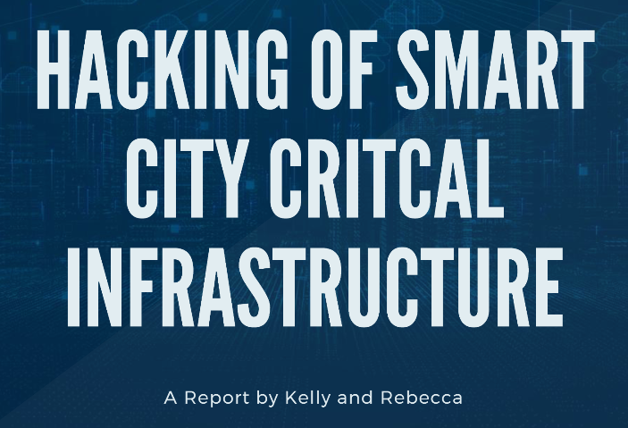

# Smart City Critical Infrastructure Cybersecurity Research

**Course:** VU23217 & BSBINS401 – Cyber Security in an Organisation
**Assessment:** Research Report & Presentation
**Topic:** Cybersecurity Vulnerabilities and Attacks on Smart City Critical Infrastructure
**Collaboration:** Joint Project with Rebecca Brown
**Date:** September 2024

## Project Overview
This research project focused on identifying and analysing cybersecurity risks impacting smart city critical infrastructure. The aim was to produce a comprehensive report and a professional presentation that meet industry standards, demonstrating a strong grasp of both technical and communication skills.

## Research Focus
- Examination of vulnerabilities in IoT and sensor networks within urban environments
- Analysis of attack vectors targeting smart city components such as traffic management, utilities, and public safety systems
- Detailed case studies including the Industroyer malware attack on Ukraine’s electrical grid (2016) and the Atlanta ransomware attack (2018)
- Evaluation of preventative measures and cybersecurity strategies designed to protect interconnected urban systems
- Exploration of emerging challenges facing smart cities’ cybersecurity resilience

## Key Skills Demonstrated
### Technical Expertise
- Conducted in-depth threat analysis covering multiple attack methodologies and vulnerabilities
- Assessed real-world cyber incidents to understand business and operational impacts
- Gained insights into IoT, SCADA systems, and smart city infrastructure security

### Professional Communication
- Produced a well-structured, industry-standard research report with clear citations and formatting
- Synthesized complex information from academic and industry sources into a coherent narrative
- Designed and delivered a visually engaging PowerPoint presentation suitable for diverse audiences
- Collaborated effectively with team members, sharing research, writing, and review responsibilities

## Tools and Frameworks
- Smart City technologies: IoT sensors, smart grids, traffic management systems
- Security frameworks and standards: OWASP, NIST, ISO 27001
- Australian cybersecurity context: ACSC guidelines and national initiatives
- Malware and attack analysis: Industroyer and SamSam ransomware

## Deliverables

### Research Report
- Executive summary outlining key vulnerabilities in smart city infrastructure
- Comprehensive technical and business impact analysis of critical components
- Case studies with detailed attack scenarios and lessons learned
- Strategic recommendations for enhancing cybersecurity defenses
- Professional formatting including citations, table of contents, and references

### Presentation 
- Concise summary of research findings
- Visual illustrations of attack methods and their impacts
- Clear communication aimed at both technical and non-technical stakeholders
- Well-organised slides emphasizing information hierarchy and design

## Collaboration and Learning Outcomes
- Coordinated joint research and source evaluation with team members
- Shared writing and editing duties to produce high-quality deliverables
- Conducted peer reviews to ensure accuracy and professionalism
- Developed skills in systematic research, risk assessment, and translating technical content
- Increased awareness of cybersecurity challenges in smart city environments